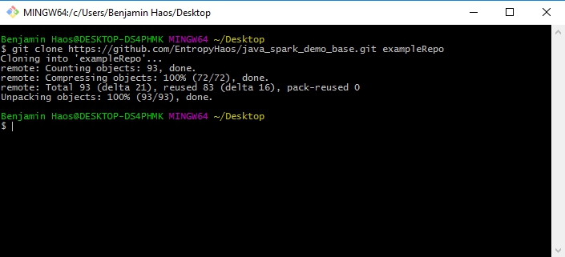
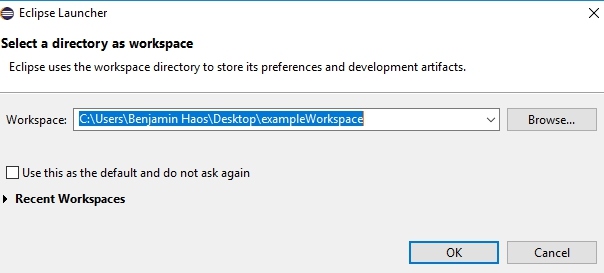
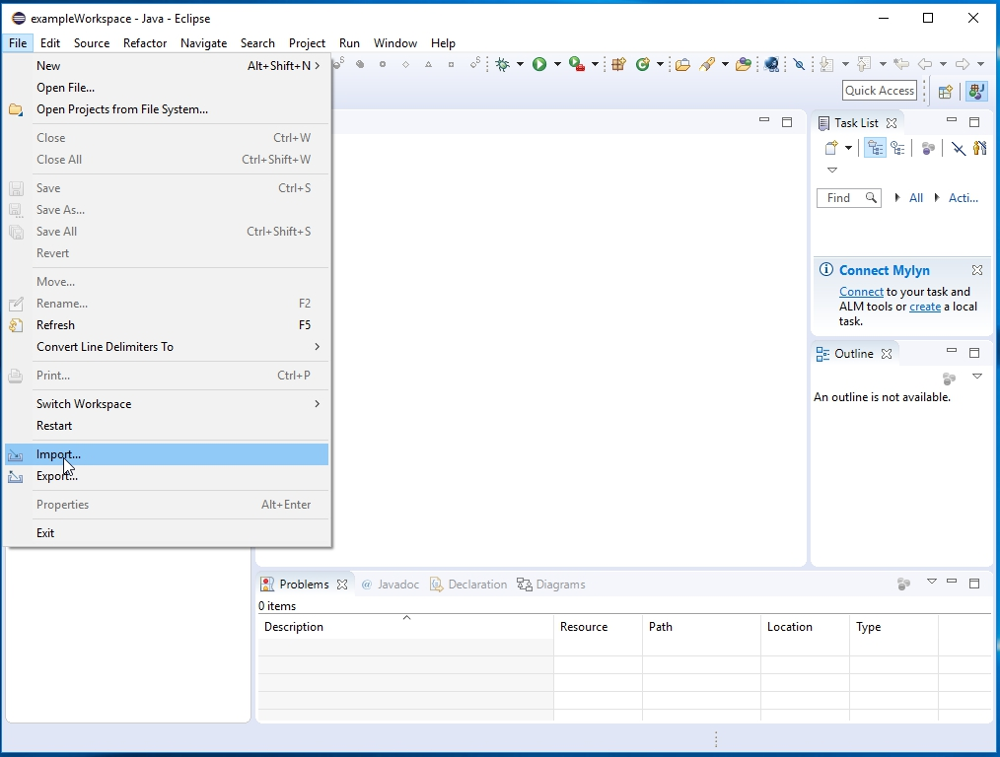
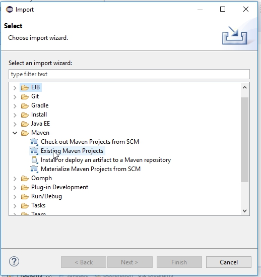
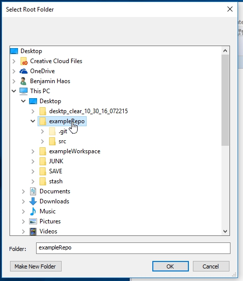
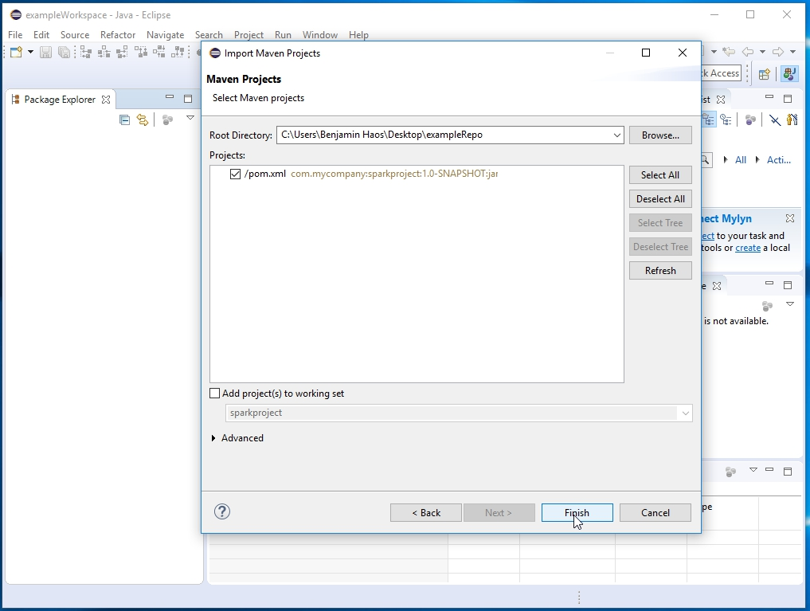
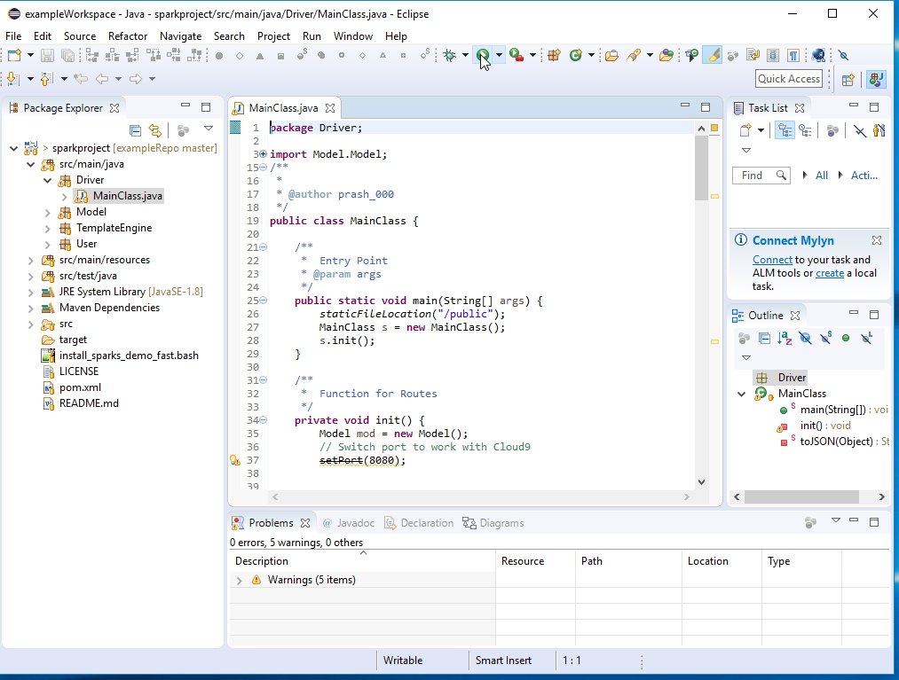
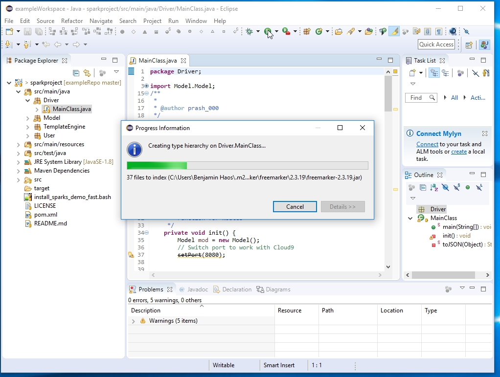
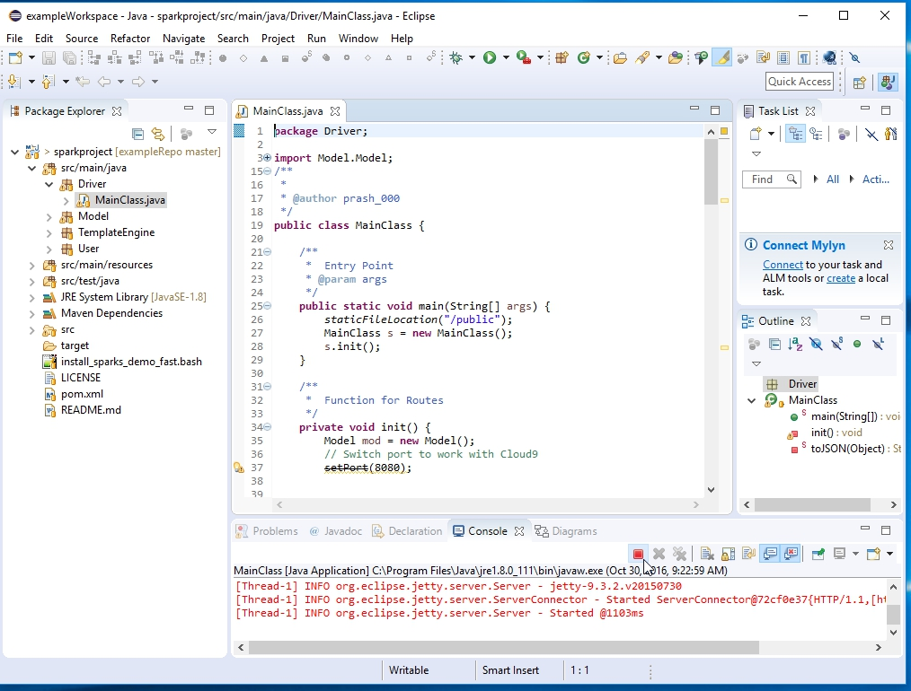
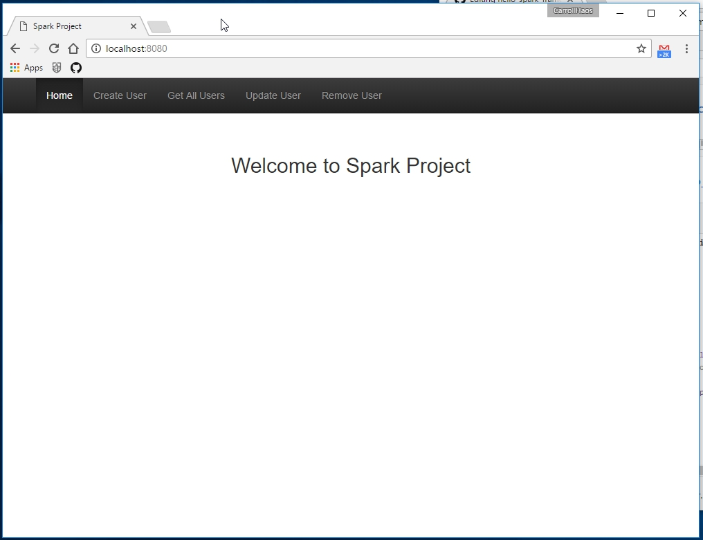

## How To Setup a Java Spark Framework in Eclipse.

This is a basic run down of the steps i use to setup the Java Spark Framework in Eclipse.
## Tools Used

* git *git for windows*
* Eclipse *Version: Neon.1a Release (4.6.1)*
* Chrome Browser

# In Git:

* Clone the example repo into a folder outside of your workspace.
  * ```git clone https://github.com/EntropyHaos/java_spark_demo_base.git exampleRepo```



# In Eclipse:

* Create a workspace in an empty folder.



* From the file menu tab, click import.


 
* In the Import Menu, choose Existing Maven Projects.


 
* Select the repo you downloaded and click ok.


 
* Click Finish.



* Open the MainClass.java file in your editor and click the green run arrow.



* You should see a progress indicator.



* Followed by a terminal displaying output from the server.



# In a Browser:

 * Visit : ```localhost:8080```
 



 
 


